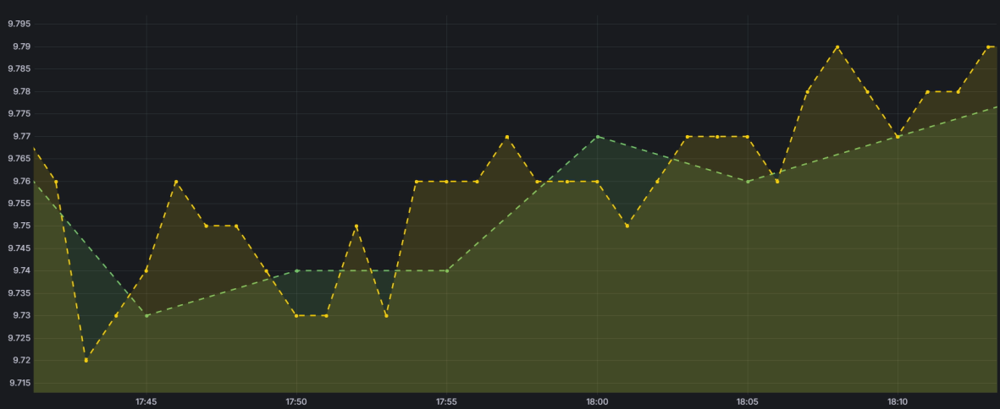
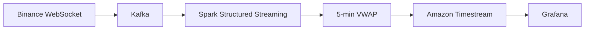

# Real-Time Cryptocurrency Data Pipeline

End-to-end data engineering pipeline for **Chainlink (LINK)** market data, combining a historical batch pipeline (AWS S3 → Glue → Spark → QuickSight) with a real-time streaming pipeline (Binance → Kafka → Spark Structured Streaming → Timestream → Grafana).



## What it does
- **Batch pipeline**: ingests historical OHLCV data into an S3 Bronze/Silver/Gold lakehouse, computing SMA-200, EMA-50, MACD and RSI-14, visualized in QuickSight
- **Streaming pipeline**: consumes live Binance trades via Kafka, computes rolling 5-minute VWAP with Spark Structured Streaming, and stores results in Amazon Timestream
- **Live dashboard**: Grafana queries Timestream to display real-time price and VWAP

## Tech stack
Python · PySpark · Apache Kafka · Spark Structured Streaming · AWS (S3, Glue, Timestream, QuickSight) · Grafana

## Architecture



## Run it

```bash
git clone https://github.com/Inigo-Serrano/real-time-crypto-pipeline.git
cd real-time-crypto-pipeline
python -m venv .venv && source .venv/bin/activate
pip install -r requirements.txt
cp .env.example .env  # fill in Kafka/AWS credentials

python src/streaming/binance_producer.py
spark-submit src/streaming/vwap_processor.py
python src/consumers/quote_to_timestream.py
python src/consumers/vwap_to_timestream.py
```

📄 Full architecture, indicator formulas, and batch pipeline details: [`docs/ARCHITECTURE.md`](docs/ARCHITECTURE.md)

---
Team project — Big Data Processing Technologies, Universidad Pontificia Comillas (ICAI). I contributed across architecture, implementation, cloud integration, streaming, analytics, testing and debugging.
