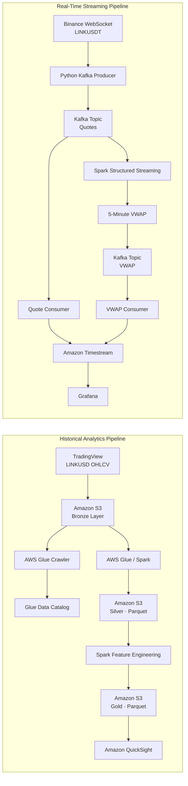

# Real-Time Cryptocurrency Data Pipeline

End-to-end data engineering and analytics pipeline for historical and real-time cryptocurrency market data. The system processes **Chainlink (LINK)** data through two complementary architectures:

- a **historical batch pipeline** using AWS S3, AWS Glue, Apache Spark, Parquet and Amazon QuickSight;
- a **real-time streaming pipeline** using Binance WebSockets, Apache Kafka, Spark Structured Streaming, Amazon Timestream and Grafana.

The project transforms raw market data into analytics-ready datasets, computes technical indicators including **SMA-200, EMA-50, MACD, RSI and VWAP**, and exposes both historical and real-time insights through interactive dashboards.

> **Team project:** developed as part of Big Data Processing Technologies coursework at ICAI. I contributed across the full development lifecycle, including architecture, implementation, cloud integration, streaming, analytics, testing and debugging.

---

## Architecture



---

## Tech Stack

| Area | Technologies |
|---|---|
| Programming | Python, PySpark |
| Streaming | Apache Kafka, Spark Structured Streaming |
| Live Market Data | Binance WebSocket API |
| Historical Data | TradingView market data |
| AWS | Amazon S3, AWS Glue, Glue Data Catalog, Amazon Timestream, Amazon QuickSight |
| Storage | CSV, Parquet, JSON |
| Analytics | Pandas, Spark DataFrames |
| Visualization | Grafana, Amazon QuickSight |

---

# Historical Analytics Pipeline

## 1. Historical Data Ingestion

The batch pipeline retrieves historical **LINKUSD OHLCV** market data covering **2022–2025**, separates records by year and uploads them to an Amazon S3 Bronze layer.

```text
s3://<bronze-bucket>/LINKUSD/
├── year=2022/
│   └── linkusd2022.csv
├── year=2023/
│   └── linkusd2023.csv
├── year=2024/
│   └── linkusd2024.csv
└── year=2025/
    └── linkusd2025.csv
```

Partitioning by year reduces unnecessary scans and makes downstream processing more efficient.

---

## 2. Schema Discovery with AWS Glue

An **AWS Glue Crawler** scans the raw S3 objects and registers their schema in the **Glue Data Catalog**.

The crawler can be provisioned programmatically with `boto3`, allowing the ingestion layer to be reproduced without manually recreating the metadata configuration.

---

## 3. Bronze → Silver Transformation

AWS Glue and Spark load the yearly CSV partitions, clean and normalize the data, and write the resulting dataset into a Silver layer using **Apache Parquet**.

Parquet provides columnar storage, efficient compression and faster analytical reads than the original CSV representation.


---

## 4. Silver → Gold Feature Engineering

The Silver datasets are combined in Spark and enriched with market indicators before being written back to S3 as year-partitioned Gold-layer Parquet files.

The feature-engineering stage computes:

### Simple Moving Average — SMA-200

A 200-period moving average used to identify the long-term market trend.

### Exponential Moving Average — EMA-50

A 50-period exponential moving average assigns greater weight to recent prices:

```text
EMA_t = α · Price_t + (1 - α) · EMA_(t-1)

α = 2 / (N + 1)
```

For EMA-50:

```text
α = 2 / 51
```

After the Gold-layer Spark DataFrame is ordered chronologically, the relevant data is converted to Pandas and the recursive EMA is calculated with:

```python
pdf["EMA_50"] = pdf["close"].ewm(
    span=50,
    adjust=False
).mean()
```

This avoids incorrectly representing a simple rolling average as an exponential moving average.

### MACD

The **Moving Average Convergence Divergence** indicator is calculated from two exponential moving averages:

```text
EMA_12 = 12-period exponential moving average
EMA_26 = 26-period exponential moving average

MACD = EMA_12 - EMA_26
```

The implementation uses the same recursive exponential weighting:

```python
pdf["EMA_12"] = pdf["close"].ewm(
    span=12,
    adjust=False
).mean()

pdf["EMA_26"] = pdf["close"].ewm(
    span=26,
    adjust=False
).mean()

pdf["MACD"] = pdf["EMA_12"] - pdf["EMA_26"]
```

The Pandas result is then converted back into a Spark DataFrame so the rest of the Gold-layer workflow can continue in Spark.

> This approach is appropriate for the historical dataset used in this project. For datasets too large to fit in driver memory, the recursive EMA calculation would require a distributed/stateful implementation rather than `toPandas()`.

### Relative Strength Index — RSI-14

The 14-period RSI measures the relative magnitude of recent gains and losses to identify momentum and potential overbought or oversold conditions.

### Result

The resulting Gold dataset combines the original OHLCV market data with engineered indicators including:

```text
SMA_200
EMA_50
MACD
RSI_14
```


---

## 5. Historical Analytics in Amazon QuickSight

The Gold-layer dataset is exposed to **Amazon QuickSight** for interactive exploration of historical price behavior, trading volume and technical indicators.

The dashboard allows the processed data to be compared visually across time and provides a higher-level analytical view of the transformed dataset.


---

# Real-Time Streaming Pipeline

## 1. Binance WebSocket → Apache Kafka

A Python producer connects to Binance using a WebSocket stream and subscribes to **LINKUSDT 1-minute candlesticks**.

Only closed candles are forwarded downstream so that the pipeline processes completed market observations rather than continuously changing partial candles.

Example event:

```json
{
  "symbol": "LINKUSDT",
  "@timestamp": "2026-04-14T17:10:59Z",
  "close": 9.08,
  "volume": 12.0
}
```

The event is serialized as JSON and published to a Kafka quote topic.

---

## 2. Kafka → Spark Structured Streaming

Spark Structured Streaming consumes the quote topic and performs the real-time transformation pipeline.

The stream:

1. deserializes Kafka messages;
2. validates and parses their schema;
3. converts timestamps to Spark event time;
4. removes malformed records;
5. filters zero-volume observations;
6. groups observations into **5-minute event-time windows**;
7. computes **VWAP** for each window.

### Volume Weighted Average Price

```text
VWAP = Σ(Price × Volume) / Σ(Volume)
```

The resulting aggregated event contains the symbol, time window and calculated VWAP.

Example:

```json
{
  "window_start": "2026-04-14T17:05:00.000Z",
  "window_end": "2026-04-14T17:10:00.000Z",
  "symbol": "LINKUSDT",
  "vwap": 9.09
}
```

These results are published to a second Kafka topic dedicated to derived analytics.

---

## 3. Kafka → Amazon Timestream

Two independent consumers persist the real-time streams in **Amazon Timestream**:

- the **quote consumer** stores market closing prices;
- the **VWAP consumer** stores the derived 5-minute VWAP observations.

Keeping raw market observations and derived metrics as separate streams decouples ingestion from analytics and makes each component independently replaceable.

The consumers convert timestamps to epoch milliseconds and write time-series records through `boto3`.


---

## 4. Grafana Real-Time Monitoring

Grafana queries Amazon Timestream and displays the live **LINK price and 5-minute VWAP** together.

This provides an end-to-end visualization of the streaming architecture:

```text
Binance
   ↓
Kafka
   ↓
Spark Structured Streaming
   ↓
VWAP
   ↓
Kafka
   ↓
Amazon Timestream
   ↓
Grafana
```


---

# Repository Structure

```text
real-time-crypto-pipeline/
├── src/
│   ├── historical/
│   │   ├── tradingview_client.py
│   │   ├── upload_to_s3.py
│   │   └── create_glue_crawler.py
│   │
│   ├── streaming/
│   │   ├── binance_producer.py
│   │   └── vwap_processor.py
│   │
│   └── consumers/
│       ├── quote_to_timestream.py
│       └── vwap_to_timestream.py
│
├── notebooks/
│   ├── silver_layer.ipynb
│   └── gold_layer.ipynb
│
├── docs/
│   └── images/
│       ├── s3-silver-layer-s3.png
│       ├── gold-layer-indicators.png
│       ├── quicksight-price-volume.png
│       ├── streaming-terminals.png
│       └── grafana-realtime.png
│
├── .env.example
├── .gitignore
├── requirements.txt
└── README.md
```

---

# Running the Project

The project is composed of two independent workflows:

- the **historical pipeline**, which combines local Python scripts with **AWS Glue Interactive Sessions**;
- the **real-time pipeline**, which runs as several long-lived local processes connected to Kafka and Amazon Timestream.

The original coursework infrastructure used university-managed AWS and Kafka resources. To reproduce the project independently, configure equivalent resources in your own AWS account and provide your own Kafka broker credentials through environment variables.

---

## Requirements

### Local environment

- Python 3.10+
- Java runtime compatible with your Apache Spark version
- Apache Spark / PySpark
- Access to an Apache Kafka broker
- Python dependencies from `requirements.txt`

### AWS

The historical pipeline requires:

- Amazon S3
- AWS Glue
- Glue Data Catalog
- Amazon QuickSight for visualization

The real-time pipeline requires:

- Amazon Timestream
- AWS credentials with permission to write to the configured database and tables

Grafana is optional and is used to visualize the Timestream data.

---

## Local Setup

Create a virtual environment:

```bash
python -m venv .venv
source .venv/bin/activate
```

Install the Python dependencies:

```bash
pip install -r requirements.txt
```

The requirements include the local Python dependencies used by the ingestion, Kafka, Spark and AWS integration code. AWS Glue itself is a managed runtime and is not installed through this file.

Create a local environment file:

```bash
cp .env.example .env
```

Configure the required values:

```env
KAFKA_BOOTSTRAP_SERVERS=
KAFKA_USERNAME=
KAFKA_PASSWORD=

AWS_REGION=
AWS_PROFILE=

TIMESTREAM_DATABASE=
TIMESTREAM_QUOTES_TABLE=
TIMESTREAM_VWAP_TABLE=
```

AWS credentials can be configured through the normal AWS SDK credential chain, for example with the AWS CLI or an AWS profile. Real credentials must never be committed to the repository.

---

# Running the Historical Pipeline

The historical workflow combines local ingestion scripts with AWS Glue processing:

```text
TradingView
   ↓
Local Python
   ↓
Amazon S3 Bronze
   ↓
AWS Glue Crawler / Data Catalog
   ↓
AWS Glue Interactive Session
   ↓
Silver Parquet
   ↓
AWS Glue Interactive Session
   ↓
Gold Parquet + Technical Indicators
   ↓
Amazon QuickSight
```

## Step 1 — Upload Historical Market Data

Run locally:

```bash
python src/historical/upload_to_s3.py
```

This step retrieves historical **LINKUSD OHLCV** data from TradingView, separates it by year and uploads the resulting CSV files to the configured S3 Bronze bucket.

---

## Step 2 — Create / Run the AWS Glue Crawler

Run locally:

```bash
python src/historical/create_glue_crawler.py
```

This script provisions or configures the Glue crawler used to discover the Bronze-layer schema and register it in the **Glue Data Catalog**.

The AWS account must contain a valid IAM role and S3 resources configured for the crawler.

---

## Step 3 — Build the Silver Layer in AWS Glue

The notebook:

```text
notebooks/silver_layer.ipynb
```

is designed for an **AWS Glue Interactive Session**, not a standard local Jupyter runtime.

The notebook uses Glue-specific configuration and APIs including:

```text
%glue_version 5.0
GlueContext
SparkContext
Job
```

Open the notebook in an AWS Glue-compatible notebook environment and execute its cells.

It performs:

```text
S3 Bronze CSV
   ↓
AWS Glue / Apache Spark
   ↓
Cleaning and normalization
   ↓
Parquet
   ↓
S3 Silver
```

---

## Step 4 — Build the Gold Layer in AWS Glue

Run:

```text
notebooks/gold_layer.ipynb
```

in the same type of **AWS Glue Interactive Session**.

This notebook combines the Silver datasets and performs feature engineering, including:

```text
SMA-200
EMA-50
EMA-12
EMA-26
MACD
RSI-14
```

Spark is used for loading, cleaning and ordering the historical data. The recursive exponential moving averages are then calculated with `pandas.ewm(..., adjust=False)` before the enriched dataset is converted back to Spark.

The transformed records are written as Gold-layer Parquet data in Amazon S3.

---

## Step 5 — Visualize Historical Analytics

The Gold-layer output can then be connected to **Amazon QuickSight**.

QuickSight is a visualization layer and does not require an additional Python process to remain running.

It is used to explore historical:

- price;
- volume;
- trend indicators;
- momentum indicators.

---

# Running the Real-Time Pipeline

The real-time architecture uses four continuously running processes.

Open **four separate terminals** after configuring Kafka and AWS credentials.

```text
Terminal 1
Binance → Kafka Quotes

Terminal 2
Kafka Quotes → Spark → 5-Minute VWAP → Kafka VWAP

Terminal 3
Kafka Quotes → Amazon Timestream

Terminal 4
Kafka VWAP → Amazon Timestream
```

---

## Terminal 1 — Binance Producer

Run:

```bash
python src/streaming/binance_producer.py
```

This process:

1. connects to the Binance WebSocket API;
2. subscribes to LINKUSDT 1-minute candlesticks;
3. forwards completed candles to the Kafka quote topic.

Keep this process running.

---

## Terminal 2 — Spark VWAP Processor

Run:

```bash
spark-submit src/streaming/vwap_processor.py
```

This process:

1. consumes the Kafka quote topic;
2. parses and validates the incoming events;
3. applies event-time windows;
4. calculates **5-minute VWAP**;
5. publishes the derived values to the Kafka VWAP topic.

Keep this process running.

---

## Terminal 3 — Quote Consumer

Run:

```bash
python src/consumers/quote_to_timestream.py
```

This process consumes the raw quote topic and writes closing-price observations into **Amazon Timestream**.

Keep this process running.

---

## Terminal 4 — VWAP Consumer

Run:

```bash
python src/consumers/vwap_to_timestream.py
```

This process consumes the VWAP topic and writes the derived 5-minute VWAP observations into **Amazon Timestream**.

Keep this process running.

---

## Real-Time Visualization

When the four processes are active, the data flow is:

```text
Binance
   ↓
Kafka Quotes
   ├──────────────────────────┐
   ↓                          ↓
Spark Structured      Quote Consumer
Streaming                    ↓
   ↓                    Amazon Timestream
5-Minute VWAP                 ↑
   ↓                          │
Kafka VWAP                    │
   ↓                          │
VWAP Consumer ────────────────┘
                              ↓
                           Grafana
```

**Grafana** queries Amazon Timestream and can display the live LINK closing price and the derived VWAP series together.

Grafana is a visualization layer; it is not launched by any of the Python scripts in this repository.

---

## Reproducing the Original Coursework Environment

The original implementation used university-managed resources, including Kafka infrastructure, AWS account configuration, S3 buckets, IAM roles and Timestream tables.

Those identifiers and credentials are intentionally excluded from this public portfolio version.

To reproduce the system independently, create equivalent resources in your own environment and provide their configuration through environment variables.
# Key Engineering Concepts

This project combines several data-engineering concepts in one system:

- batch and streaming architectures;
- Bronze / Silver / Gold data-lake design;
- schema discovery and metadata cataloging;
- columnar Parquet storage;
- cloud-native data processing;
- Kafka producer/consumer architecture;
- distributed event processing;
- event-time windowing;
- real-time financial analytics;
- technical-indicator feature engineering;
- time-series databases;
- interactive BI and monitoring dashboards.

---

# Security

No credentials or institution-specific infrastructure identifiers should be committed to the repository.

Secrets are loaded through environment variables and local `.env` files, while `.env.example` documents the required configuration without containing real credentials.

The public repository should never contain:

```text
.env
AWS access keys
Kafka passwords
API tokens
account-specific identifiers
course-delivery PDFs
```

---

# Project Background

This project was developed collaboratively as part of coursework at **Universidad Pontificia Comillas ICAI**.

I contributed across the project rather than owning only one isolated component, participating in the architecture, implementation, integration, analytics, cloud configuration, streaming pipeline, testing and debugging.

The repository published here is organized as a clean engineering portfolio version of the project, with coursework documents and institution-specific configuration excluded.

---

# Possible Extensions

Potential future improvements include:

- containerizing Kafka and the streaming services with Docker Compose;
- automated integration tests for the streaming pipeline;
- CI/CD validation with GitHub Actions;
- dead-letter handling for malformed Kafka events;
- additional cryptocurrencies and dynamically configurable symbols;
- more technical indicators such as Bollinger Bands or ATR;
- alert generation based on combinations of MACD, RSI and VWAP signals;
- infrastructure-as-code for AWS resources;
- benchmark dashboards for throughput and end-to-end latency.

---

## Authors

Team project developed at **Universidad Pontificia Comillas ICAI**.

Portfolio version maintained by **Íñigo Serrano**.
